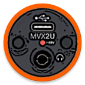

ShureDroid
==========



Built off of [USB HID Terminal](https://github.com/452/USBHIDTerminal),
this connects to a Shure MVX2U to send/receive HID packets.


## Need Help?

Please **do not** complain to Shure! The goal is to stay off their radar so this project _might live forever_.

**Do** create an issue (good) or merge request (better) if you find or fix a problem.

Fork or use the discussion board if you want major changes, such as a new UI or support for more Motiv mics.

-----

Also, bear with me. I am _not_ an Android developer and am not considering it as a career future or hobby.
I know a lot of C&mdash;enough C to modify someone else's Java until I can connect to my own MVX2U for twenty
seconds at 3:00 a.m. and toggle a few features on my phone running a single version of Android.

What am I saying? If you have a problem, **I** might not be the person to solve it, but the community might
eventually get to a solution. This is further complicated by some factors:

1. I might miss Github notifications in my email inbox.
2. I might not have time to work on something.
3. I won't research unfamiliar topics for long e.g. async, i18n, theme, a11y (see _lack of free time_)
4. I won't merge anything I don't understand. (Blame my mechatronics professor for that.)
5. I don't want publicity or interaction with the justice system.
6. I dislike most Material You apps and see that form of beautification as a bit of a waste of time.

(This last point is less valid if/when Shure condones this app. If that happens, I wouldn't mind so much
polishing up the interface.)

As-is, I barely understand the source that I already _have_. I try to keep everything readable by writing
packet data as hex strings, but then it has to hit the USB buffer as a byte array after some intermediate
calculations like length and CRC16. I don't know anything about layouts and views and how to connect each
different element e.g. text and seekbar. Sometimes the IDE states functions are never called, but they
actually are called from an event generator in a different file. I'm not sure how messed up memory gets
with a statement like `String s = new String((a == 1) ? "ok" : "not ok");`. I don't know what causes the
USB to drop out after a few minutes or how I might persist permissions.

So please&hellip;
**Write issues. Comment on issues. Write pull requests.** Keep PRs small and explain them in junior dev terms.
If work stalls or you need something out-of-scope (access to other Motiv mics), fork and maintain this.

- [Current roadmap](https://github.com/PennRobotics/ShureDroid/milestones)
- [Issues](https://github.com/PennRobotics/ShureDroid/issues)
- [Discussion](https://github.com/PennRobotics/ShureDroid/discussions)


## Getting Started

_The .apk is currently being developed. Build from source._

With time, I will try to get an .apk listed here and will probably publish to F-Droid[^3].

[^3]: I have decided against publishing on the Google Play Store. There are too many hurdles having to generatea new developer account (creating a new email, coming up with an account name and namespace, paying 25 bucks, verifying my ID, always keeping my source up-to-date, spending less time with family) and then I would still probably get my app rejected automatically because it has a USB intent for an odd device class or would likely get the app removed after Shure complains.

Anyone else is welcome to repackage this source, change the namespace, and submit it to the Play Store.
I just do not have the time, know-how, resources, or willpower&hellip;

<!-- TODO: f-droid link -->
<!-- TODO: link apk in releases -->

### Build

_You could refer to the 452 repo, which has been adapted for this repo:_

```sh
git clone https://github.com/PennRobotics/ShureDroid.git
cd ShureDroid
./gradlew build
```

I have not tried those steps but build in Android Studio instead. I don't know that there is anything special
here w.r.t. Gradle, and the fact that I haven't had issues building is a breath of fresh air; most build
systems I use still need some baseline knowledge and manual intervention.

My steps? Load the project in the current version of Android Studio, click build, then send the binary to the
emulator or to a smartphone. The hardest part has been ensuring KVM is enabled and USB user permissions are correct.


## Checklist

_This is gradually being moved to [Milestones](https://github.com/PennRobotics/ShureDroid/milestones)_

- [ ] go through source and resolve each TODO comment
- [ ] go through source and eliminate unneeded imports, declarations, etc.
- [ ] see if there are low-hanging fruits in the source, like unnecessary (back-and-forth) type conversions
- [ ] send and receive configuration packets for all known settings
    - [x] most, anyway. the rest probably have a TODO comment
- [x] create crude UI for each packet
    - [x] crude != lack of rounded corners. that was intentional and preferred.
- [x] fix USB device detection/capture
    - [ ] sometimes device drops out after being in background or sitting for a few minutes
        - [ ] is that why the official app is constantly polling?          
- [ ] UI/code improvements
    - [ ] bring back status bar (clock, icons, etc.)
    - [ ] fix all of the Studio complaints
        - [ ] accessibility (spoken text)
        - [ ] touch target size
    - [ ] Maybe skip the connection dialog but still indicate connection state with mic icon colors
    - [ ] I'm gonna have to take PRs for these:
        - [ ] Better choice of layouts
        - [ ] Better choice of views
        - [ ] Better choice of widgets
        - [ ] Cleaner code
        - [ ] Translations
        - [ ] Dark mode and/or better theme support
        - [ ] EQ view like the Spotify app
        - [ ] Get the whole thing looking great on tablet, too
        - [ ] In manual mode, put a gain slider in a system notification popup
        - [ ] In auto mode, put one or more of the auto mode toggles in a system notification popup
        - [ ] Whatever else people feel is appropriate


## Legal Information

In short: end users, use this software at your own risk and within the boundaries of your own laws.
Shure, please do not sue or C&amp;D (it does not make sense) and instead make an official app for Android.

I am a U.S. citizen with permanent EU residency. Both territories specifically allow examining software
in the case of establishing interoperability with independent computer programs. (EU Computer Programs
Directive 2009/24/EC; 17 U.S.C. section 1201) My Android application, ShureDroid&mdash;which extends the
functionality of the Shure MVX2U adapter to the Android operating system&mdash;was built using a standard
USB protocol capture and examination. USB communication packets were recorded between a Windows PC and
the adapter that I legally own during normal use in accordance with the Shure EULA. This was the extent
of my use of the Motiv Desktop application. These initial packet recordings were then used to generate a
packet testing script in order to generate valid and invalid packets. The test packets were transmitted
fully outside of the Motiv software and used to discover typical responses to requests from the adapter
and to improve error handling as well as better characterize if the device has specific connection
requirements or limitations. No hidden functionality, firmware keys or encryption techniques were discovered
as a result of packet testing. There is no feature of this Android app that is not also part of the
Motiv Desktop software.

There are **no reasonable grounds** for Shure Inc. to believe their intellectual property has been
breached nor a strong defense of the decision to limit functionality of their adapter to computers with
Windows or MacOS installed. In fact, the USB Audio endpoints are seemingly class compliant, so volume
adjustments and audio transfer work across the majority of Android devices. The microphone adapter works
as an input on an Android smartphone, so an end user should be able to adjust the settings while connected.

I have checked for reasonable restrictions applied by Shure to analysis of the adapter and what
constitutes unlawful use of its software license. The current user guide for the adapter has important
safety instructions, a hearing damage warning, FCC regulation information, usage details, operating
advice, general functionality descriptions, troubleshooting steps, specifications, and certifications.
There are no prohibitions on viewing its communications or sending USB data from a third-party
application. The current installation of the Motiv Desktop software does not (rather, can not) prohibit
the legal examination of the communication protocol if the goal is to improve software interoperability.
ShureDroid does not rely on any part of the Motiv software for its creation or operation and would be
considered either a legally permissable derived work or simply a compatible third-party application.

No attempt was made to obscure or otherwise differentiate the standard USB HID protocol. Determining
the structure of the MVX2U USB HID data packets is trivial. No attempt is made to encrypt USB HID
packets despite the MVX2U microcontroller having native support for on-the-fly decryption. There is
a standard 16-bit checksum sent at the end of each packet&mdash;presumably to ensure the packet was
not erroneously generated or altered. Publication of the structure of the data packets is not prohibited
as they were not derived from source code and were collected&mdash;without needing to circumvent or
decompile the standard communication method&mdash;solely for the purpose of extending interoperability[^1].
Creation of a third-party app that implements the data packet structure can not violate the Motiv
Desktop EULA. The point is specifically mentioned in section 5.v (_derivative works_) that any work
derived from software might not (and in this case, in my limited understanding of the law, _shall not_)
be restricted due to the nature of its origin: software interoperability.

[^1]: Let me reemphasize this point: The only reason I started examining the MVX2U USB protocol was
to get this adapter to fully function on Linux. After successfully creating a Linux client and using
the adapter in its vendor-restricted form on Android devices, I decided to extend my work to Android.
I can't record a brass band in auto mode, as the gain fluctuates too quickly; and I'm not lugging
around a laptop that I can dial in the manual gain setting when my goal is to plunk down my phone
and mic on a small stand and start recording in under 10 seconds.

I have intentionally left out any byte sequences needed to check and update firmware as firmware
update packages are not made publicly available, and publication of these details could be considered
a violation of technical protection measures (expressly and legally prohibited in the Motiv software
EULA) and goes beyond the scope of simple examination. I am not going to share this information
whether I have it or not. Do not ask.

The ID request packet was discovered during packet testing and is otherwise found to be
nonfunctional and harmless, so I have kept it in my protocol details and in ShureDroid.

Shure obviously wants a one-sided relationship with end users; to be free from any and all liability,
be fully in control of who uses their software and how, to even have the option to brick their
devices and delete all their software (quite clearly defined in EULA section 2, _Updates_), and
restrict resolution of product defects by forcing arbitration in nearly all cases. Being a bit of
an idiot, I expect Shure to respect my rights as an independent developer and a daily user of
Linux/Android: I would request Shure not preemptively and/or frivolously take action to remove
this source code, binaries built from this source code, and easily discovered information about
their protocol. Rather, be thoughtful in the reasons this app was written and use that to guide
product development moving forward![^2]

[^2]: In fact, anyone fuzz testing the configuration endpoint of the adapter with basic USB HID
demos and making consecutive frequency sweeps with an attached microphone would be able to
_French Cafe_ the protocol without ever installing the Motiv software. It doesn't take long to
get an error packet, and then work your way toward a valid packet structure, the hardest part
finding the 0x11 0x22 sequence, which might even have some purpose like "header length" and
"max length" but are never-changing.

Note: Shure makes _extensive_ use of free and open-source libraries in their Electron-based
configuration application, Motiv Desktop. It would be a real jerk move to decide against
supporting FOSS software used with their adapter. In fact, I am doing the opposite of the
prohibited example in 18.1.2, _restrictions_, by engaging in an activity that aims to render
the Motiv hardware _more_ operable and _simpler_!

With all of this in mind, the publication of the USB HID protocol and a third-party application
implementing this protocol (derived from an USB HID terminal app and using no Shure software)
are fully within my rights, and I believe a reasonable court would agree but also do not want
to test my belief.

My part of the deal: I will quickly remove errors or portions of this code that have the
potential to be abused or that _actually_ constitute a violation of the EULA and would
additionally purge any removed source from the history of the source code. I would also
remove any trace of ShureDroid fully and immediately under the condition that native,
feature-complete support of the MVX2U in either Android or Linux is planned with a six-month
horizon (and delivered within 12). I will make UI changes to satisfy branding/trademark
requirements.

Shure is permitted with my blessing to use any of this source as a starting point to
cross-reference the Android documentation for their own development of an Android and/or Linux
application. Motiv Audio already has functionality to support similar microphones and seems to
be missing _only_ the USB host feature. There are quite a few reviews on the Google Play Store
and Reddit lamenting the lack of MVX2U support, so I am not alone in wanting interoperability
of the MVX2U adapter. I have **no expectation of compensation** (money, recognition, etc.) now
or in the future. Despite their policy on unsolicited ideas, I would hope Shure extends their
software offerings to support more operating systems. (A main selling point of this adapter is
size, portability, and that it allows users to choose from any XLR-terminated microphone, yet
its strict feature dependence on a laptop or desktop computer unnecessarily restricts users.)

Furthermore, I assert that if Shure attempts to terminate my license specifically, this would be
a violation of their legal obligations as the seller of the hardware that my software supports.
(Not that it matters&hellip; I can't use Motiv Desktop in Linux or Android, my two daily drivers!)
If I have not violated the terms of our mutual software license, I expect the vendor to permit my
continued usage of their software as any other end user in my region. Both EU and German law are
quite strict on consumer rights and the enforcability of EULA terms&mdash;particularly where the
software and terms of that software are made available after registration and the purchase of
hardware. While vendors are generally permitted to unilaterally terminate a license, the targeted
(e.g. punative) revokation of my license due to publishing this software would be grounds for me
to seek legal relief. I might just ask what the ice cube's worth.

(Disputes about this repository would likely center around enforcement and validity of IP rights,
since what I have published here is the simple protocol designed by Shure and a program for using
this protocol, and Shure states IP rights are excepted from arbitration.)

I accept that the development and use of my independent software with the MVX2U adapter on an
unsupported operating system is at my own risk. There is the possibility that an Android device
cannot meet the specifications needed or is otherwise unsuitable or even dangerous to use with the
microphone adapter. So far, I haven't found that to be the case. (In fact, USB power sourced from
a DC battery and isolated from utility frequency ground has been quite noise-free.) If I break my
adapter and/or smartphone by using this software (or the packet explorer script) then _c'est la vie_;
I do not and would not hold Shure responsible for damage to my gear resulting from my unsanctioned
use of third-party software with my legally owned MVX2U adapter.

It is also my goal to ensure this software always presents itself as an obviously unofficial
application. Use of the MVX2U faceplate as an icon is merely indicative of the hardware supported
by the software. Branding specific to Shure (logos, fonts, colors, similarities to existing software)
shall be avoided where possible, and a warning to users would be listed alongside the binary and
as a text snippet in the main app window.

Legality aside: If the mutual goal of Shure and mine is to get more people using this adapter,
my software is a step in the right direction.


## License

This is a fork of software published by _emetemunoy_. I am continuing to use the same license
and have provided the original notice without changes (mostly because Apache is confusing and
I don't know the right thing to do to create a fork of Apache-licensed software):

### LICENSE

Copyright 2024 452 emetemunoy.

Licensed under the Apache License, Version 2.0 (the "License");
you may not use this file except in compliance with the License.
You may obtain a copy of the License at

<http://www.apache.org/licenses/LICENSE-2.0>

Unless required by applicable law or agreed to in writing, software
distributed under the License is distributed on an "AS IS" BASIS,
WITHOUT WARRANTIES OR CONDITIONS OF ANY KIND, either express or implied.
See the License for the specific language governing permissions and
limitations under the License.
